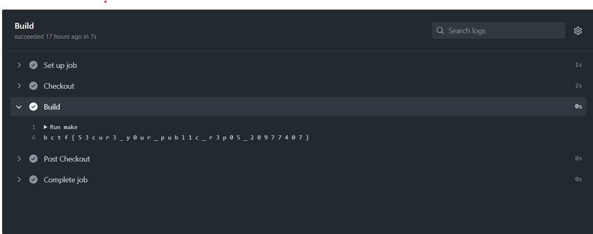
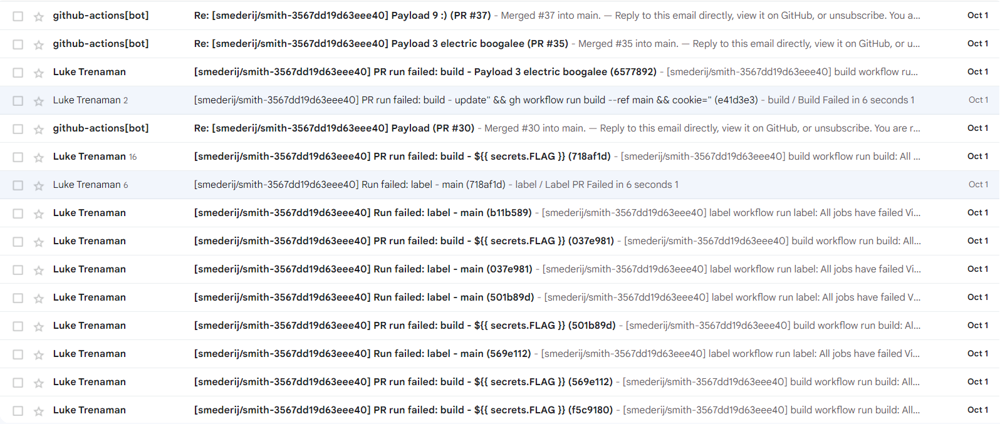

### Challenge
Name: smerderij
Category: misc
Difficulty: medium

### Solution
1. Fork the repository
2. Make a pull request with the Makefile as specified in this directory
3. Create a separate PR with the title `update" && gh pr merge 30 --merge && cookie="`
4. Close and reopen the PR with the title `update" && gh workflow run build --ref main && cookie="`
5. Go to the Workflow for main that just started running and find the space separated-flag in the console.

### Explanation

Make a PR with a Makefile to output the flag, [space separating](https://zellwk.com/blog/debug-github-actions-secret/) it so Github does not remove the secret from the logs. As we are [making a PR from a forked repository](https://docs.github.com/en/actions/security-guides/using-secrets-in-github-actions#using-secrets-in-a-workflow), the `FLAG` secret won't be exposed to our Makefile, it just logs "". Our motivation is to run a workflow in the base repository to expose the flag.

Use a string injection to execute arbitrary `gh` API requests from within the "label" workflow. As a bonus we can label all of our PRs as "enhancements". The line to inject exists in `label.yml` which is the only pipeline with `write-all` permissions. It has this line:
```
title="${{ github.event.pull_request.title }}"
```
Which we inject to
```
title="update" && put arbitrary commands here && cookie=""
```
The two commands we want to inject are merge (get our Makefile on the base repository), and workflow (run the workflow on the main branch). Because the `label.yml` pipeline runs on pull requests, we can open two arbitrary pull requests to execute these commands. Using the payloads in steps 3 and 4 of the solution will reveal the flag in a new workflow:


### Bonus
The failed attempts...

